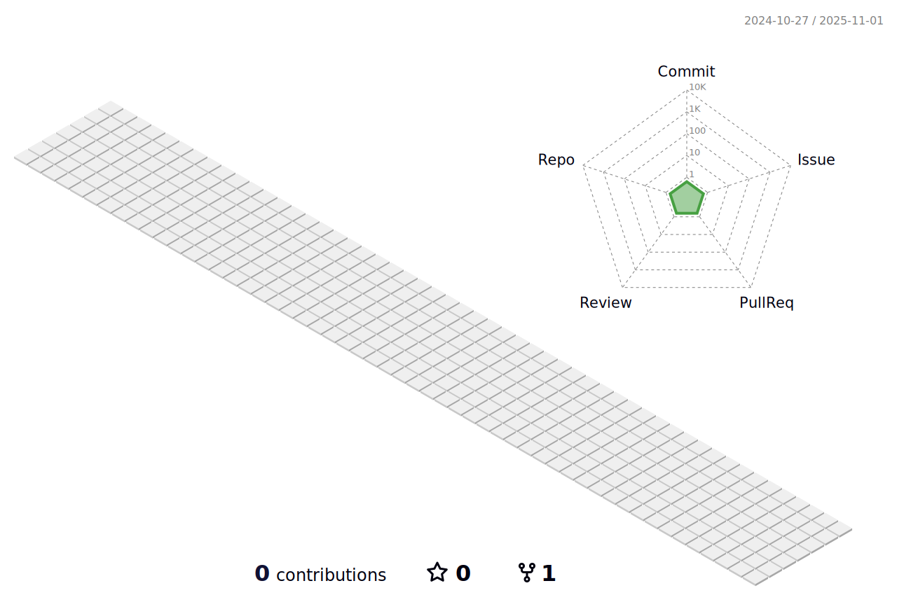

<!--
    RakibSarowar's GitHub Profile
    Created on : 10/1/2022
    Author     : Rakib Sarowar
    Contact    : rakibsarowar@gmail.com

    -----------------------------------------------------------------------
    -----------------------------------------------------------------------
    
    Thank you if you like this profile README!

    BUT, please DO NOT copy this and create your profile based on it.
    You can use it as a reference, and copy a part of it, but DO NOT copy
    all of this and create your profile based on it.

    It is very common that you forget to change some information and leave
    mine in your profile.

    Only when you know what you are copying should you paste it. So, again,
    please DO NOT copy this and create your profile based on it.

    ---------------------------------------------------------------------

    What's more, you can find other awesome profile READMEs at
    https://github.com/abhisheknaiidu/awesome-github-profile-readme.
    There could be a profile README that fits you better than this one.

    ---------------------------------------------------------------------
    
    Wish you a good-looking profile README!

                                —— rakib S. (https://github.com/rakibsarowar)
-->

 

 

<h1> Hi there! 👋, This is Rakib Sarowar   
 
<!-- about repository badges start -->

  
  
 <!-- <a style="margin-right: 6px" href="https://github.com/montasim/montasim/issues/new?template=Guestbook_entry.md&title=Adding+<username>+to+guestbook">
    
  </a> -->
  

<!-- about repository badges end -->
 </h1>

  

###

And also, a passionate Web Developer from Gazipur, Bangladesh.

Welcome to my GitHub profile. Already, I've shared my info in above. Rest of that, I love to code in my free times and have strong knowledge of JavaScript, React JS, Vue JS, Next JS, Express & MongoDB. I usually seek out new knowledge, technology and actively for developing my skills. Asiding full stack, I love play with Next Js & Redux. 

🟪 👀 I’m interested in Web Development  
🟪 🌱 I’m currently learning Redux JS, Next JS & Vue JS. 
🟪 📫 You can reach me in LinkedIn(as same name) or in email: rakibsarowar@gmail.com

 
 

<!-- Heading text start -->

    

<!-- Heading text end -->

 

 

 

<!-- Heading text start -->

    

<!-- Heading text end -->

 

 

<!-- Heading text start -->

    

<!-- Heading text end -->

 

  
  
  
  

 

<!-- TROPHIE Heading text start -->

    

<!-- Heading text end -->

 
 

  

 

<!-- Heading text start -->

    

<!-- Heading text end -->
 

---
 

  

 

